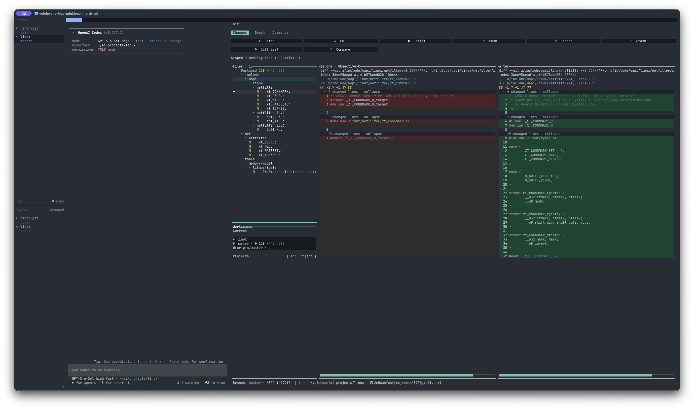
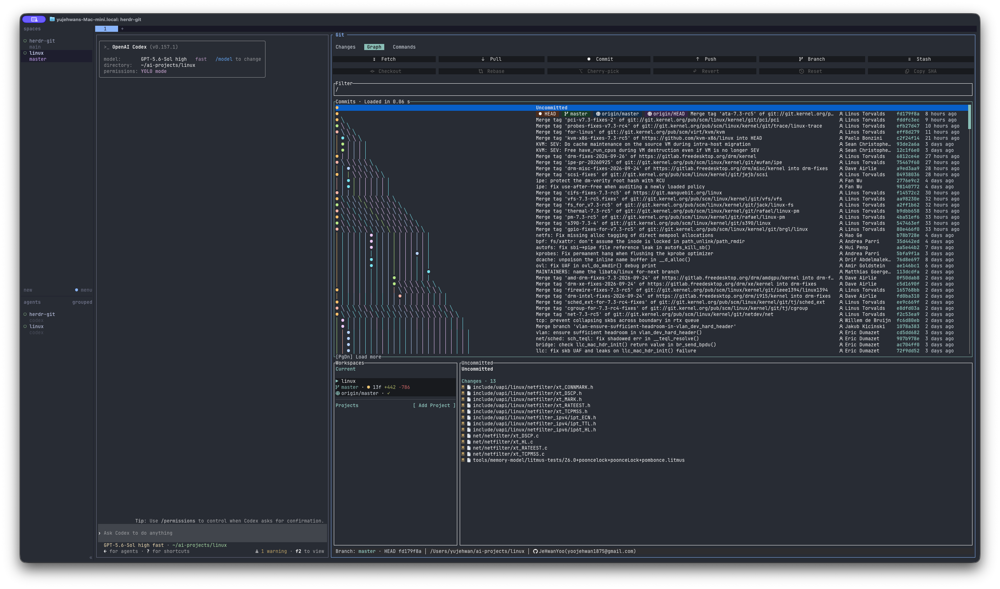

# Herdr Git

<p>
  
  
</p>

A Git client for Herdr, focused on the essentials.

## Install

Requires Herdr 0.8.0 or later on macOS or Linux.

```sh
herdr plugin install JeHwanYoo/herdr-git
herdr plugin action invoke io.github.jehwanyoo.herdr-git.open
```

Run the command to toggle the Git pane.

To bind it to `prefix+u`, add this to `~/.config/herdr/config.toml`:

```toml
[[keys.command]]
key = "prefix+u"
type = "plugin_action"
command = "io.github.jehwanyoo.herdr-git.open"
description = "toggle Git pane"
```

Press `Ctrl+b`, then `u` to open the Git sidebar on the right.

## Features

| Feature | What you can do |
| --- | --- |
| Changes | Review changed files and stage or unstage them |
| Diffs | View changes side by side and compare commits or branches |
| Graph | Browse and filter commit history |
| Blame & Line History | See who changed selected lines and review their history |
| Copy | Copy selected code with its file path and line numbers |
| Commit | Create or amend a commit, or ask an Agent to write it |
| Remotes | Add, view, or remove remotes; fetch, pull, and choose where to push |
| Branches & Tags | Create branches and tags, or switch branches |
| Rebase | Rebase onto a branch or commit, including interactive rebase |
| Cherry-pick, Revert & Reset | Apply a commit, undo it, or reset to it |
| Stash | Save uncommitted changes and restore them |
| Workspaces | Switch between repositories, Projects, and worktrees |

## Keyboard Shortcuts

Hold `Alt` to see all keyboard shortcuts.

## Development

Install [just](https://just.systems/man/en/installation.html), then run:

```sh
just link   # Build, link the plugin, and bind prefix+u
just check  # Check formatting, Clippy, and tests
```

Run `just link` again after changing Rust to rebuild the linked binary.

## Changelog

[Changelog](CHANGELOG.md)

## License

[MIT](LICENSE)
